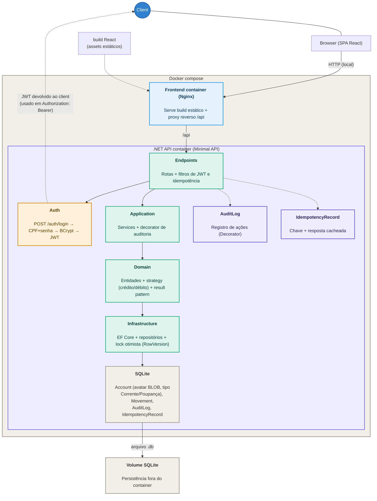

# 💰 DinDin.exe

<p align="center">
  
</p>

[](https://github.com/tabskey/dindin-exe/actions/workflows/ci-test.yml) [](https://dotnet.microsoft.com/)
[](https://www.typescriptlang.org/)

### Sistema de controle de movimentações de conta

**DinDin.exe** é uma aplicação para controle de movimentações de uma conta empresarial, com suporte a entradas, saídas, consulta de saldo e histórico de movimentações — sem nunca permitir saldo negativo. 🤑

O projeto é composto por uma API em **C# / .NET 10 (Minimal API)** e um frontend em **React 19 + Vite + TypeScript**.

> **Status atual:** o backend está completo — regras de negócio, persistência (EF Core + SQLite), autenticação JWT, endpoints, idempotência, auditoria, controle de concorrência e testes (unitários + integração). O frontend também está completo — login, extrato com saldo/histórico, movimentações (depósito/saque com contraparte), avatar e tema claro/escuro, com testes (Vitest + Playwright) e análise de qualidade (SonarQube local). O andamento detalhado está em [`docs/API_DEV_CHECKLIST.md`](./docs/API_DEV_CHECKLIST.md), [`docs/FRONTEND_DEV_CHECKLIST.md`](./docs/FRONTEND_DEV_CHECKLIST.md) e [`docs/AGENT_LOG.md`](./docs/AGENT_LOG.md).

A documentação completa da arquitetura está disponível em [`docs/ARCHITECTURE.md`](./docs/ARCHITECTURE.md), incluindo o diagrama de system design e os ADRs em [`docs/adr/`](./docs/adr/). Para apresentações, há um resumo consolidado das decisões e dos porquês em [`docs/APRESENTACAO.md`](./docs/APRESENTACAO.md).

As regras para agentes de IA que trabalharem neste repositório estão em [`docs/AGENTS.md`](./docs/AGENTS.md).

---

## 🚀 Rodando o DinDin.exe

### Docker

Pré-requisito: apenas **Docker e Docker Compose** instalados.

Não é necessário instalar o .NET SDK ou Node.js localmente.

```bash
git clone <url-do-repositorio>
cd <pasta-do-repositorio>

docker compose up --build
```

Isso sobe dois containers:

| Serviço      | URL                    | O que é                                                  |
| ------------ | ---------------------- | -------------------------------------------------------- |
| 🖥️ Frontend | `http://localhost`     | React 19 + Vite, build de produção servido via Nginx     |
| 💸 API       | `http://localhost/api` | .NET 10 Minimal API, acessada via proxy reverso do Nginx |

O banco SQLite (`dindin.db`) é persistido em um **volume** (`sqlite-data`): os dados sobrevivem a `docker compose down`. Na primeira subida, migrações e seed (contas de teste) são aplicados automaticamente.

> A chave de assinatura do JWT fica **fora do repositório**: copie `.env.example` para `.env`, gere um valor forte em `Jwt__Key` e rode `docker compose up --build`. Sem o `.env`, a API falha no startup com uma mensagem clara pedindo a chave.

### Parando a aplicação

```bash
docker compose down      # mantém os dados no volume
docker compose down -v   # apaga também o volume (banco zerado)
```

---

## 💻 Rodando sem Docker

Para desenvolvimento local:

```bash
# backend
cd src/backend/Api
dotnet restore
dotnet run
```

Antes do `dotnet run`, defina a variável de ambiente `Jwt__Key` (PowerShell: `$env:Jwt__Key = "<chave-forte>"`).

Em outro terminal:

```bash
# frontend
cd src/frontend
npm install
npm run dev
```

O backend sobe em `http://localhost:5041`, conforme o perfil `http` definido em `src/backend/Api/Properties/launchSettings.json`.

O frontend sobe em `http://localhost:5173`.

Nesse modo não há o proxy reverso do Nginx: o Vite repassa `/api` para `http://localhost` (Docker, porta 80) — se a API rodar fora do Docker (`dotnet run`, porta 5041), ajuste o `target` em `src/frontend/vite.config.ts`. O fluxo manual completo de requisições está em [`src/backend/Api/Api.http`](./src/backend/Api/Api.http).

---

## 🧪 Contas de teste (seed)

Ao iniciar, o backend cria automaticamente contas de teste (todas correntes) para facilitar a avaliação:

| CPF              | Senha      | Nome         |
| ---------------- | ---------- | ------------ |
| `111.111.111-11` | `senha123` | Ana Teste    |
| `222.222.222-22` | `senha123` | Bruno Teste  |
| `333.333.333-33` | `senha123` | Carlos Teste |

---

## 🔐 Autenticação

Autenticação por **CPF + senha** (hash BCrypt), devolvendo um **JWT**:

```http
POST /auth/login
Content-Type: application/json

{
  "cpf": "111.111.111-11",
  "password": "senha123"
}
```

Resposta:

```json
{
  "token": "<jwt>",
  "account": { "id": 1, "accountNumber": "00315-41", "name": "Ana Teste", "cpf": "111.111.111-11", "accountType": 0 }
}
```

O token deve ser enviado como `Authorization: Bearer <jwt>` nas rotas protegidas, que só permitem acesso aos dados da própria conta (`accountId` do token confere com o da rota).

> 🔒 Aqui o DinDin é seu.
> O DinDin dos outros continua sendo dos outros.

---

## 💸 Endpoints

| Método | Rota                       | Auth | Observação                                                                   |
| ------ | -------------------------- | ---- | ---------------------------------------------------------------------------- |
| `POST` | `/auth/login`              | —    | Autentica por CPF + senha e devolve JWT                                      |
| `POST` | `/accounts`                | —    | Cria uma conta — Corrente/Poupança via `accountType` (0/1) (`Idempotency-Key` opcional) |
| `POST` | `/accounts/{id}/movements` | ✔    | Entrada/saída na própria conta; depósito com contraparte vira **transferência** (`Idempotency-Key` obrigatório) |
| `GET`  | `/accounts/{id}/balance`   | ✔    | Consulta o saldo disponível                                                  |
| `GET`  | `/accounts/{id}/movements` | ✔    | Consulta o histórico de movimentações paginado                               |
| `POST` | `/accounts/{id}/avatar`    | ✔    | Envia avatar (multipart, JPEG/PNG/WebP até 512 KB)                           |
| `GET`  | `/accounts/{id}/avatar`    | ✔    | Baixa o avatar da conta                                                      |

### Exemplo de criação de conta

```http
POST /accounts
Idempotency-Key: 7f2a2e3e-...
Content-Type: application/json

{
  "name": "Ana Teste",
  "cpf": "444.555.666-77",
  "password": "senha123",
  "accountType": 1
}
```

`accountType` é numérico: `0` = Conta Corrente (padrão), `1` = Conta Poupança. O tipo aparece no
login e no cabeçalho do extrato ("Conta 00XXX-XX · Conta Corrente/Poupança").

### Exemplo de movimentação

```http
POST /accounts/1/movements
Authorization: Bearer <token>
Idempotency-Key: 7f2a2e3e-...
Content-Type: application/json

{
  "type": 0,
  "amount": 15000,
  "counterpartyCpf": "222.222.222-22"
}
```

`amount` é o valor em **centavos inteiros** (ex.: R$ 150,00 → `15000`). `type` é numérico: `0` = crédito, `1` = débito. A chave de idempotência garante que repetir a requisição não duplica a movimentação.

**Contraparte** (quem é a outra parte da movimentação):

- Depósito **sem** contraparte → auto-depósito (`AUTO-DEPOSITO 00319-78 CC`): crédito na própria conta.
- Saque → auto-saque (`AUTO-SAQUE 00319-78 CC`): débito na própria conta; contraparte não é aceita em saque.
- Depósito **com** `counterpartyCpf` ou `counterpartyAccountNumber` → **transferência**: débito na sua conta e crédito na conta do destinatário; os dois extratos registram (o seu como saída "para {destinatário}", o dele como entrada "de {você}"). `counterpartyAccountNumber` tem precedência sobre o CPF.
- Destinatário inexistente, transferência para si mesmo ou saldo insuficiente → erro `400`.
- O label da contraparte usa o **número da conta** (`00XXX-XX`, ex.: `BRUNO TESTE 00614-98 CC`) — único por construção; o antigo fragmento de CPF (`NNN-NN`) podia se repetir entre contas.

A regra principal é simples:

**Crédito entra. Débito sai. Depósito com contraparte move o dinheiro. Saldo negativo não passa.**

---

## 🏗️ Arquitetura

**Clean Architecture enxuta**, evitando camadas e abstrações desnecessárias para o problema:

```text
Api → Application → Domain
              ↑
       Infrastructure
```

### Diagrama do system design



Decisões arquiteturais implementadas (motivações em [`docs/adr/`](./docs/adr/)):

* **Strategy** para os tipos de movimentação (crédito/débito);
* **Decorator** para auditoria, desacoplando essa responsabilidade da regra de negócio;
* **Idempotency Filter** (`IEndpointFilter`) evitando duplicidade em operações críticas;
* **Lock otimista** (`RowVersion` no EF Core) protegendo o saldo em movimentações concorrentes;
* **EF Core + SQLite** com migrações e seed no startup;
* **Result pattern** — erros de regra de negócio retornam como valor, não como exception.

### Frontend

**React 19 + TypeScript + Vite**, com **Tailwind CSS v4** e ícones `lucide-react`. Sem
gerenciador de estado global além do React — arquitetura enxuta, por camadas (`pages/`,
`components/`, `context/`, `hooks/`, `lib/`):

- **Navegação** — React Router com URL por tela: `/login` (pública) e `/extrato` (protegida); o
  guard é um `Navigate` no `App.tsx` (autenticado → extrato, não autenticado → login).
- **Sessão** — `AuthProvider` + hook `useAuth` (`context/`): token JWT e conta persistidos em
  `localStorage`; logout automático em qualquer `401` via `registerUnauthorizedHandler`.
- **Dados** — `lib/api.ts` (client `fetch` sobre `/api`, `ApiError` com `status`, erros mapeados
  para pt-BR e `Idempotency-Key` por tentativa nas movimentações) e `lib/masks.ts` (CPF, conta,
  moeda).
- **Componentes** — `Modal` base acessível (overlay, Esc, foco, trava de scroll) especializado em
  `MovementModal`, `AvatarModal` e `CreateAccountModal` (com seletor de tipo corrente/poupança);
  `ThemeToggle` para tema claro/escuro; o cabeçalho do extrato mostra número e tipo da conta.
- **Tema** — o hook `useTheme` alterna a classe `.dark` no `<html>` e persiste no `localStorage`;
  a paleta vive em tokens CSS (`:root`/`.dark` no `index.css`) mapeados via `@theme` do Tailwind
  (mudar cor = editar só os tokens). Um script inline no `index.html` evita flash do tema errado.

Testes e qualidade do frontend estão na seção [🧪 Testes](#-testes); decisões em
[`docs/adr/0004`](./docs/adr/0004-frontend-sessao-e-client-de-api.md) (navegação, sessão e client)
e [`docs/adr/0005`](./docs/adr/0005-testes-e-qualidade-no-frontend.md) (Vitest + Playwright +
SonarQube).

A documentação detalhada e o diagrama estão em [`docs/ARCHITECTURE.md`](./docs/ARCHITECTURE.md).

---

## 🧪 Testes

**128 testes, todos verdes** (`dotnet test`):

### Testes unitários

Regras de domínio e serviços: saldo negativo, strategies de crédito/débito, contraparte, auditoria, idempotência, seed e migrações.

### Testes de integração

`WebApplicationFactory` + SQLite (arquivo temporário) exercitando a API real: fluxo completo (criar conta → login → movimentação → saldo → histórico), contraparte, idempotência (replay não duplica; corpo divergente → 409), paginação, 401/403/404, avatar e débitos concorrentes nunca negativos.

Cobertura total de linhas: **94,3%** — o CI (`ci-test.yml`) falha se ficar abaixo de 80%.

### Testes do frontend

**88 testes, todos verdes** — cobertura de linhas **96,9%** (meta ≥ 80%; 0 bugs, 0 code smells,
0 vulnerabilidades): 82 de componentes/regras (Vitest + Testing Library) e 6 E2E (Playwright,
fluxos completos no navegador). A suíte Vitest roda em ~30s e o E2E em ~7s (máquina local, Windows).

- **Vitest + Testing Library** (`npm test`): máscaras, client de API (fetch mockado), login,
  criação de conta, extrato, movimentação, avatar, modal e tema; `npm run coverage` gera o `lcov`
  que alimenta o SonarQube.
- **Playwright** (`npm run test:e2e`): login → extrato → depósito → saque → transferência e criar
  conta → login preenchido; requer o app + API no ar (`docker compose up -d --build`) com o seed
  carregado.
- **SonarQube local** (`docker-compose.sonarqube.yml`, http://localhost:9000): análise via scanner
  em container; cobertura de linhas **96,9%** (meta ≥ 80%), 0 bugs, 0 code smells, 0 vulnerabilidades.

---

## 📐 Decisões de escopo

Algumas funcionalidades foram avaliadas e ficaram fora do escopo do projeto:

* **Hierarquia de contas** — conta pai visualizando todas as contas filhas;
* **Refresh token e múltiplos papéis de usuário** — JWT simples é suficiente para o escopo;
* **Recuperação de senha real**;
* **Edição/exclusão de conta**, por não fazerem parte do escopo proposto.

---

## 📁 Estrutura do repositório

```text
src/
├── backend/                # Backend .NET (solution + camadas)
│   ├── Api/                # Minimal API .NET 10 (endpoints, JWT, avatar)
│   ├── Application/        # Services, DTOs, decorator de auditoria, idempotency filter
│   ├── Domain/             # Entidades, regras de negócio, strategies
│   ├── Infrastructure/     # EF Core, repositórios, migrações, seed
│   └── Api.Tests/          # Testes unitários e de integração
└── frontend/               # React 19 + Vite + TypeScript
    ├── src/
    │   ├── pages/          # LoginPage e ExtratoPage (rotas)
    │   ├── components/     # Modal base, modais de domínio e ThemeToggle
    │   ├── context/        # AuthProvider + sessão (JWT)
    │   ├── hooks/          # useTheme (tema claro/escuro)
    │   ├── lib/            # api.ts (client HTTP) e masks.ts (máscaras)
    │   ├── test/           # helpers de teste (router, setup)
    │   ├── index.css       # tokens de tema (Tailwind v4)
    │   └── App.tsx         # rotas + guard de autenticação
    └── e2e/                # Playwright (fluxos E2E no navegador)

docs/
├── ARCHITECTURE.md         # Arquitetura completa + diagrama
├── API_DEV_CHECKLIST.md    # Controle das fases de implementação
├── APRESENTACAO.md         # Decisões e porquês (material de apresentação)
├── FRONTEND_DEV_CHECKLIST.md # Controle das fases do frontend
├── AGENTS.md               # Regras para agentes de IA no repositório
├── AGENT_LOG.md            # Log de execução dos agentes
├── adr/                    # Registro de decisões de arquitetura
├── system-design.png       # Diagrama do system design
└── arquitetura-sistema-conta.pdf

docker-compose.yml          # API + frontend + volume SQLite
docker-compose.sonarqube.yml # SonarQube local (qualidade/cobertura do frontend)
```

---

## 🤑 DinDin.exe em uma frase

> **Seu dinheiro, agora em formato executável.**

Ou, como preferimos dizer:

> **Se o saldo ficar negativo, o DinDin.exe falhou.**
