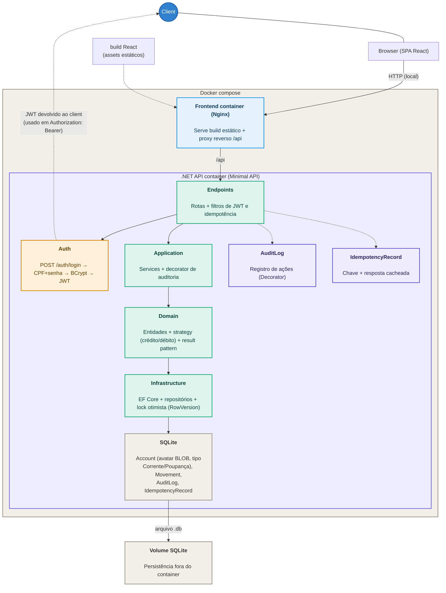

# Arquitetura — Sistema de controle de movimentações de conta

Documento vivo. Qualquer mudança estrutural aprovada via ADR (ver `docs/adr/`) deve atualizar este arquivo
na mesma alteração — ele não pode ficar desatualizado em relação ao código.

## 1. Contexto do desafio

API em C# e .NET para controlar movimentações financeiras de uma conta empresarial: registrar entradas e
saídas, consultar saldo e consultar histórico, garantindo consistência e nunca permitindo saldo negativo.
Sem arquitetura ou banco obrigatórios, e com o pedido explícito de evitar complexidade desnecessária.
Diferencial: interface em React consumindo a API.

Extensões adicionadas além do mínimo pedido, com justificativa própria: criação de conta com autenticação
simples (CPF + senha), auditoria das operações e idempotência para evitar duplicidade de movimentações.

## 2. Arquitetura geral

Minimal API com uma Clean Architecture enxuta — sem os rótulos e camadas extras de uma arquitetura
hexagonal completa. Decisão deliberada, para não inflar um domínio simples com abstrações que o desafio
não pede.

| Camada | Responsabilidade |
|---|---|
| `Api` | Endpoints Minimal API, filtros (JWT, idempotência), middlewares, DI |
| `Application` | Services, DTOs, interfaces, decorator de auditoria |
| `Domain` | Entidades (`Account`, `Movement`), regras de negócio, strategies, exceptions |
| `Infrastructure` | EF Core, DbContext, repositórios, seed de dados |

Fluxo de dependência: `Api → Application → Domain`, com `Infrastructure` implementando as interfaces
definidas pelo Domain/Application (inversão de dependência via DI nativa do .NET).

### Diagrama do system design



> Versão em imagem para exportar em slides: [`system-design.png`](./system-design.png).

## 3. Design patterns aplicados

- **Strategy** — cada tipo de movimentação (crédito/débito) valida e aplica sua própria regra sobre o
  saldo, evitando condicionais espalhadas pelo código.
- **Decorator** — a auditoria envolve os services (`AuditedAccountService`, `AuditedMovementService`) sem
  misturar log de auditoria com regra de negócio.
- **Idempotency Filter** — um `IEndpointFilter` intercepta requisições com o header `Idempotency-Key`,
  evitando duplicidade de operações críticas.
- **Repository** — interfaces específicas (`IAccountRepository`, `IMovementRepository`), sem repositório
  genérico, só o necessário para testar.
- **Result pattern** — erros de regra de negócio (ex: saldo insuficiente) retornam como valor, não como
  exception de fluxo de controle.

## 4. Modelo de domínio

**Account** — `Id`, `AccountNumber` (gerado automaticamente), `Name`, `CPF` (único), `AccountType`
(Corrente/Poupança, escolhido no cadastro — apenas cosmético, sem regra de negócio diferente entre os
tipos), `PasswordHash`, `Balance`, `CreatedAt`.

**Movement** — `Id`, `AccountId`, `Type` (Credit/Debit), `Amount`, `Timestamp`, `Counterparty`
(label da contraparte, ex.: `BRUNO TESTE 00614-98 CC`), resultado aplicado via strategy.

**AuditLog** — `Id`, `EntityType`, `EntityId`, `Action`, `Payload` (JSON), `Timestamp`.

**IdempotencyRecord** — `Key` (PK), `RequestPath`, `RequestHash`, `ResponseStatusCode`, `ResponseBody`,
`CreatedAt`.

## 5. Consistência e concorrência

O sistema precisa proteger dois cenários de concorrência distintos na mesma conta:

- **Débitos concorrentes** — o caso crítico. Duas saídas de R$80 numa conta com saldo R$100 podem, numa
  implementação ingênua ("verifica saldo → debita"), passar ambas pela validação antes de qualquer uma
  escrever, resultando em saldo negativo.
- **Créditos concorrentes** — não ameaçam a regra de saldo negativo, mas sofrem do clássico *lost update*:
  duas threads leem saldo 100 e cada uma soma 50 sem saber da outra, resultando em 150 em vez de 200.

A solução adota **lock otimista** via `RowVersion` no EF Core: qualquer segunda escrita concorrente na mesma
linha da conta — seja crédito ou débito — detecta que a versão mudou, falha com
`DbUpdateConcurrencyException`, e o service faz retry recarregando o saldo atualizado. Isso serializa
efetivamente as escritas por conta, sem exigir lock pessimista no banco, e cobre os dois cenários com a
mesma proteção.

### Contraparte

- `POST /accounts/{id}/movements` aceita `CounterpartyCpf` ou `CounterpartyAccountNumber`
  (opcional, o número tem precedência): ausente → auto-depósito (`AUTO-DEPOSITO {00XXX-XX} CC`, com o
  próprio número da conta); informado → resolve a conta por CPF ou número (únicos no schema);
  não encontrada → erro `CounterpartyNotFound` (400).
- Label congelado na criação: `{NOME EM MAIÚSCULAS, SEM ACENTO} {número da conta 00XXX-XX} CC`
  (ex.: `BRUNO TESTE 00614-98 CC`) — o número é único por construção (índice único + retry), ao
  contrário da antiga máscara de CPF (`NNN-NN`) que podia se repetir entre contas (ver ADR 0007).
- Contraparte é sempre a própria conta (depósito na boca do caixa) ou outra conta do sistema —
  ver ADR 0002/0007.

## 6. Autenticação

Autenticação simples por CPF + senha — a própria `Account` é a identidade, sem tabela de usuário separada.

- `POST /auth/login` recebe CPF e senha, devolve um JWT.
- JWT simples, sem refresh token, sem roles.
- Middleware de autorização garante que a conta só acessa os próprios dados (`accountId` do token confere
  com o da rota).
- Senhas com hash via BCrypt.

## 7. Endpoints

| Método | Rota | Observação |
|---|---|---|
| `POST` | `/accounts` | Cria conta com tipo Corrente/Poupança (`accountType`: 0/1; Idempotency-Key opcional) |
| `POST` | `/auth/login` | Autentica por CPF + senha, devolve JWT |
| `POST` | `/accounts/{id}/movements` | Registra entrada/saída (Idempotency-Key obrigatório; `CounterpartyCpf`/`CounterpartyAccountNumber` opcionais) |
| `GET` | `/accounts/{id}/balance` | Consulta saldo disponível |
| `GET` | `/accounts/{id}/movements` | Histórico de movimentações, paginado |

## 8. Persistência

EF Core + SQLite, com seed de 2-3 contas de teste (CPF e senha documentados no README) via `HasData()` ou
`DbInitializer` no startup, para quem for avaliar conseguir logar sem precisar criar conta manualmente.

## 9. Docker

Docker Compose com três peças: container da API (Dockerfile multi-stage, build SDK → runtime ASP.NET),
container do frontend (build Node → Nginx servindo o build estático, com proxy reverso para `/api`) e um
volume para persistir o arquivo SQLite entre reinícios.

```bash
docker compose up --build
```

- Frontend: `http://localhost`
- API: `http://localhost/api` (proxy reverso via Nginx)

## 10. Testes

- **Testes unitários** no domínio — foco na regra de saldo negativo e nas strategies de crédito/débito.
- **Testes de integração** na API usando `WebApplicationFactory` + SQLite em arquivo temporário (o
  banco em memória compartilha uma única conexão e não suporta requisições concorrentes), cobrindo os
  fluxos completos de criação de conta, login, movimentação, saldo, histórico, idempotência e débitos
  concorrentes.

## 11. Decisões de escopo

Fora do escopo, deliberadamente: hierarquia de contas (pai/filha), múltiplos papéis de usuário, refresh
token, recuperação de senha real (o frontend apenas indica humoradamente que o usuário deve "se dirigir à
agência"), endpoints de edição/exclusão de conta. Razões descritas no README como possíveis evoluções
futuras. Nenhuma dessas deve ser implementada sem passar pelo processo de ADR + consulta definido em
`AGENTS.md`.
